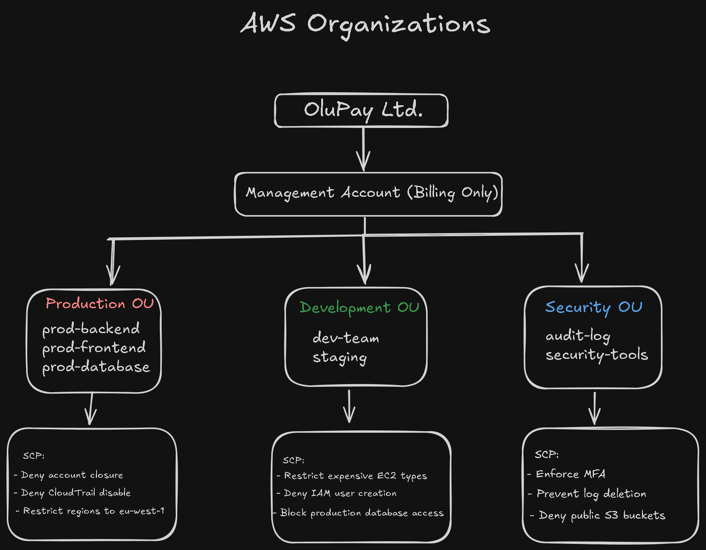
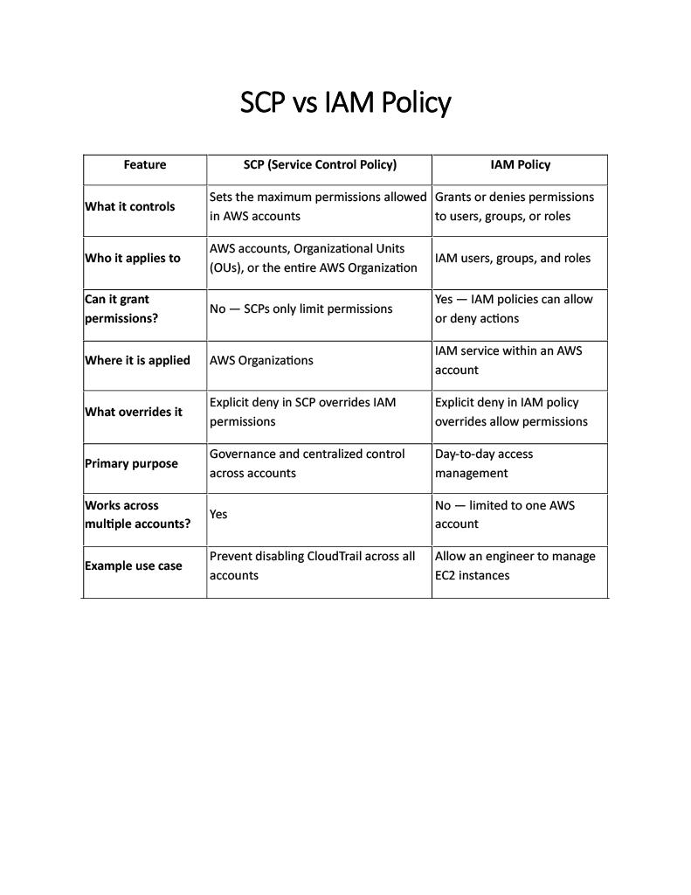

#  AWS Organizations SCP Governance Lab — OluPay Ltd


---

##  Project Overview

This project demonstrates a multi-account AWS Organizations architecture designed for a fictional Nigerian fintech company — **OluPay Ltd**.

It applies enterprise cloud governance best practices, separating workloads across Production, Development, and Security accounts while enforcing centralized control using Service Control Policies (SCPs).

---

##  Organizational Design

###  Root (Management Account)
- Handles billing only  
- No workload deployment  
- Central governance control  

---

###  Production OU
- prod-backend  
- prod-frontend  
- prod-database  

Purpose: Live customer-facing systems  

---

###  Development OU
- dev-team  
- staging  

Purpose: Testing and development workloads  

---

###  Security OU
- audit-log  
- security-tools  

Purpose: Monitoring, compliance, and security enforcement  

---

##  Architecture Diagram

Stored in:


---

##  Service Control Policies (SCPs)

SCPs are applied at the OU level to enforce governance boundaries.

### Production OU SCPs
- Restrict AWS regions  
- Deny sensitive services  
- Prevent deletion of production resources  

### Development OU SCPs
- Limit EC2 instance sizes  
- Restrict IAM privilege escalation  
- Block access to production databases  

### Security OU SCPs
- Enforce MFA for all users  
- Prevent CloudTrail deletion  
- Block public S3 access  
- Prevent log tampering  

---

## CloudTrail Protection SCP

📄 File: [cloudtrail-protection-scp.json](scp-policies/cloudtrail-protection-scp.json)

```json
{
  "Version": "2012-10-17",
  "Statement": [
    {
      "Sid": "DenyDisableCloudTrail",
      "Effect": "Deny",
      "Action": [
        "cloudtrail:StopLogging",
        "cloudtrail:DeleteTrail",
        "cloudtrail:UpdateTrail"
      ],
      "Resource": "*"
    }
  ]
}
```

Purpose:
Prevents users — including administrators — from disabling, deleting, or modifying AWS CloudTrail logging.

This helps preserve:
- Audit integrity
- Compliance requirements
- Incident investigation capabilities
- Security monitoring

---

## Leave Organization SCP

📄 File: [deny-leave-org-scp.json](scp-policies/deny-leave-org-scp.json)

```json
{
  "Version": "2012-10-17",
  "Statement": [
    {
      "Sid": "DenyLeaveOrganization",
      "Effect": "Deny",
      "Action": [
        "organizations:LeaveOrganization"
      ],
      "Resource": "*"
    }
  ]
}
```

Purpose:
Prevents AWS accounts from leaving the AWS Organization without approval.

This maintains:
- Centralized governance
- Security policy enforcement
- Organizational compliance
- Billing and account control

---

##  SCP vs IAM Policy



| Feature | SCP | IAM Policy |
|----------|-----|------------|
| Scope | Organization / OU | User / Role |
| Control Type | Guardrail | Permission grant |
| Can grant access? | ❌ No | ✅ Yes |
| Overrides | IAM policies | None |

---

##  Key Concepts

- AWS Organizations structure design  
- Multi-account architecture  
- SCP governance model  
- Security boundaries in cloud design  
- Fintech cloud security patterns  

---

##  Outcome

- Built enterprise-grade AWS organization design  
- Implemented governance with SCPs  
- Separated workloads across environments  
- Strengthened cloud security architecture  

---

##  Recruiter Value

- Demonstrates cloud architecture thinking  
- Shows a security-first mindset  
- Reflects real fintech-style AWS design  
- Strong understanding of AWS governance  

---

##  Tags

AWS Organizations · SCP · Cloud Architecture · Fintech · Multi-Account · Cloud Security
